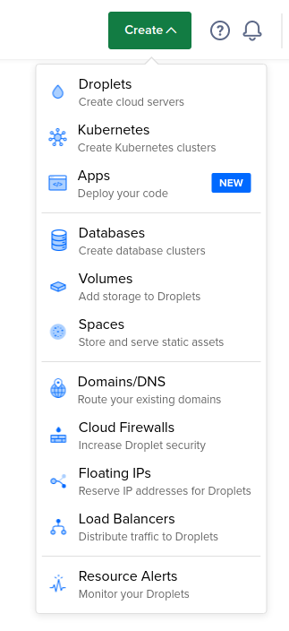
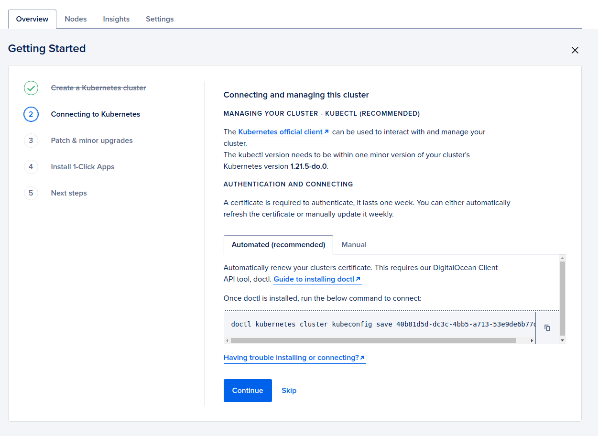
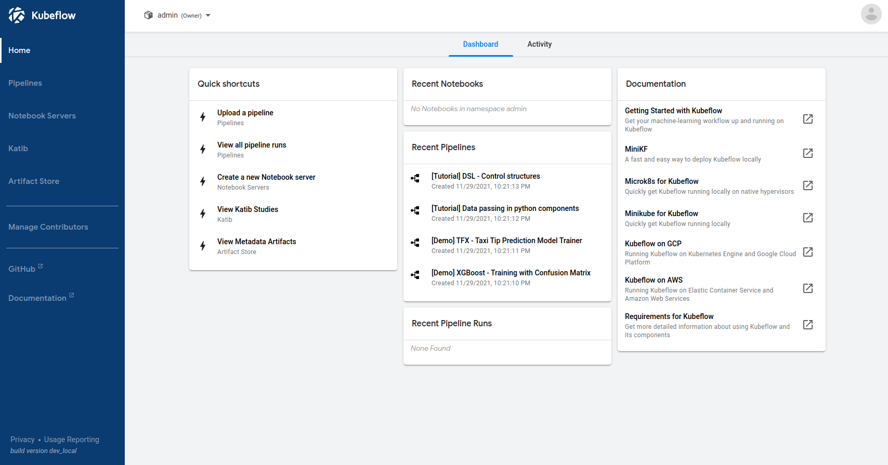

# Kubeflow-DigitalOcean
We're going to walk through how to set up a Kubernetes cluster using DigitalOcean Kubernetes (DOKS) and how to install
[Kubeflow](https://www.kubeflow.org/) on the cluster for managing ML Workflows. As a bonus we will create and deploy a simple ML pipeline using [Kubeflow Pipelines](https://www.kubeflow.org/docs/components/pipelines/), one of Kubeflow's core components.

## Prerequisites
To complete this project you will need an active [DigitalOcean](https://cloud.digitalocean.com/registrations/new) account and [kubectl](https://kubernetes.io/docs/tasks/tools/install-kubectl-linux/) installed.

## Cluster Setup
To get started, we need to deploy a Kubernetes cluster and gain access to it.
DigitalOcean provides a managed Kubernetes service (DOKS) that lets us deploy a pre-configured cluster with just a few clicks.
- Navigate to your DigitalOcean home page and click onthe Create dropdown on the upper right hand side, click on Kubernetes



- Choose a region (usually whichever is closest to you)
- Configure your node pool by adding a name, a number of nodes, and specifying the type of nodes to deploy
- Finish by giving the cluster a name and assigning it to one of your DigitalOcean projects, I made a project just for my cluster
- Hit Create Cluster
  
It may take a few minutes for your cluster to be provisioned.
We now need to work on accessing the cluster so we can issue commands to it to deploy and monitor our resources.
Under the Getting Started tab there are five steps we will follow.
Step two allows us to connect to our cluster using kubectl. In order to do this we need to download and configure a
kubeconfig file. 



Your cluster is also preconfigured to require a certificate for authentication. I recommend going with the Automated approach which will take care of configuring the appropriate context with kubectl for accessing the cluster
as well as automatically renewing the required certificate. This requires [installing and configuring doctl](https://docs.digitalocean.com/reference/doctl/how-to/install/). Once you have installed and configured doctl you are ready to go.
Verify that you are connected to your cluster by running 

```kubectl get nodes``` 

And verifying that this matches the setup
you configured during creation of the cluster. We are now ready to install Kubeflow.

## Installing Kubeflow
As a convenience and for tidiness we can create a namespace in which we will deploy all Kubeflow related resources.
This will make it easier to query for resources if we start adding more things to our cluster later.
We can do this by running

```kubectl create ns kubeflow```

Kubeflow has a [number of installation methods](https://www.kubeflow.org/docs/started/installing-kubeflow/) depending on your environment. In our case we will use kfctl, a command line tool for configuring and deploying Kubeflow. 
We will of course first have to install kfctl and the most straight forward way of doing that is grabbing an official
tar ball from its [Github repository relase page](https://github.com/kubeflow/kfctl/releases/). 
We can then unpack the tar ball by running

```tar -xvf kfctl_v1.0.2_.tar.gz```

We can then verify that it's working by running

```./kfctl version```

If you like you can add kfctl to your system path to make it globally accessible but I opted not to considering we will only use it once for our deployment. kfctl runs by acting on a KfDef file which essentially defines the components and configuration of those components to deploy into our instance of Kubeflow. Recall that Kubeflow has a number of [components](https://www.kubeflow.org/docs/components/) and plugins. A KfDef file is jsut a YAML file and you can find
many different templates on the internet for specific providers. We will be using a KfDef file that deploys a minimal installation of Kubeflow with an [Istio](https://istio.io/) service mesh and [Dex](https://dexidp.io/) for authentication.
You can copy this file by running

```wget https://raw.githubusercontent.com/learnk8s/kubeflow-pipelines-demo/master/kfctl_istio_dex.v1.0.2-pipelines.yaml```

It's a good exercise to take a peek at the file and see what is being declared and if there is anything you would like to modify. We can then generate the configuration file with kfctl via

```kfctl build -f kfctl_istio_dex.v1.0.2-pipelines.yaml```

Finally we can apply this configuration to our cluster, inside of our Kubeflow namespace by running

```kfctl apply -f kfctl_istio_dex.v1.0.2-pipelines.yaml -n kubeflow```

We can now monitor the deployment by watching the creation of all of the pods

```kubectl get pods --all-namespaces -w```

While most of the pods will be deployed in our specified kubeflow namespace there will also be networking related pods in the ```istio-system``` namespace and dex will live in its own ```auth``` namespace. Once all of the pods have a status of RUNNING we are good to go. At the time of writing, there is an issue with Dex on the latest version of Kubernetes. If your dex pod runs into an error you can likely fix it by editing the deployment. Run the following to access the deployment file

```kubectl edit deployment dex -n auth```

Then add the following under the ```spec.template.soec.containers``` field

```yaml
env:
- name: KUBERNETES_POD_NAMESPACE
  value: auth
```

Saving this should allow the dex pod to reach a running state. The final step is to expose the Kubeflow UI on a public IP so that we can have access via our browser. This particular deployment of Kubeflow comes with a service named ```istio-ingressgateway``` that points to all of the correct internal services and pods. Configuring a managed load balancer for accessing our Kubeflow instance is as simple as "patching" this service. Patching a service means modifying some of its fields in place. Run the following to patch the existing service and automatically provision a load balancer

```kubectl patch service --namespace istio-system istio-ingressgateway -p '{"spec": {"type": "LoadBalancer"}}'```

This could take a couple of minutes but once this process is complete you can run the following command to get its external IP

```kubectl get service --namespace istio-system istio-ingressgateway```

You can then access the Kubeflow UI by visiting this external IP. By default the login credentials are adimn@kubeflow.org
and 12341234. This can be changed by modifying the KfDef file but I ommitted this for simplicity. Once logged in you should see the following



We can now begin working with Kubeflow!

## Running a Pipeline
